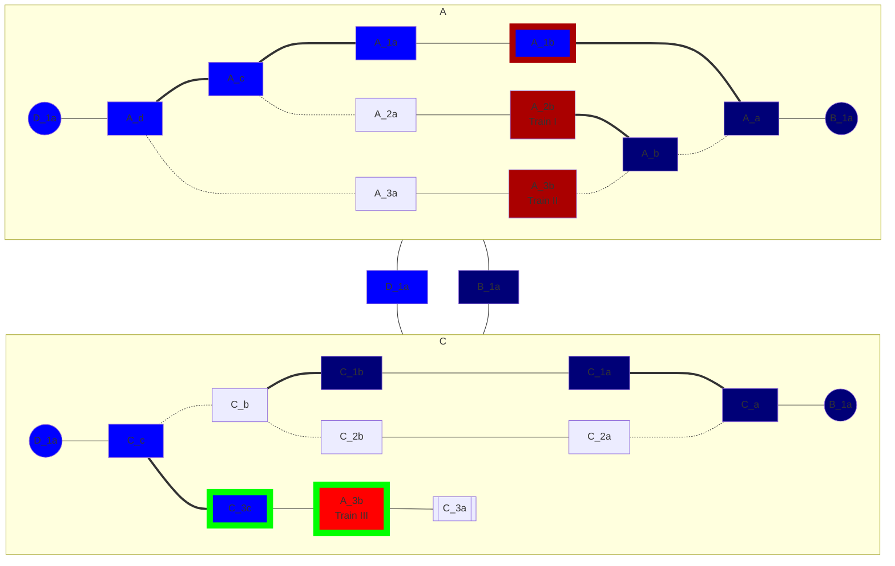

# Example layout
The arrows doesn't matter.
C_3 leads to a bumper.
New trains should be railed on C_3b.

**Legend:**
- **Blue**: Reserved for a moving train
- **Dark Blue**: Planned route for a standing train
- **Green Stroke**: Powered track
- **Red Stroke**: Reserved destination (and stop location) of a moving train
- **Red**: Track blocked by a standing train
- **Green Stroke with Red Fill**: Track blocked by a moving train
- **Dark**: Free track
- **Normal Arrow**: Connection of a track
- **Bold Arrow**: Active connection of a switch
- **Dotted Arrow**: Inactive connection of a switch